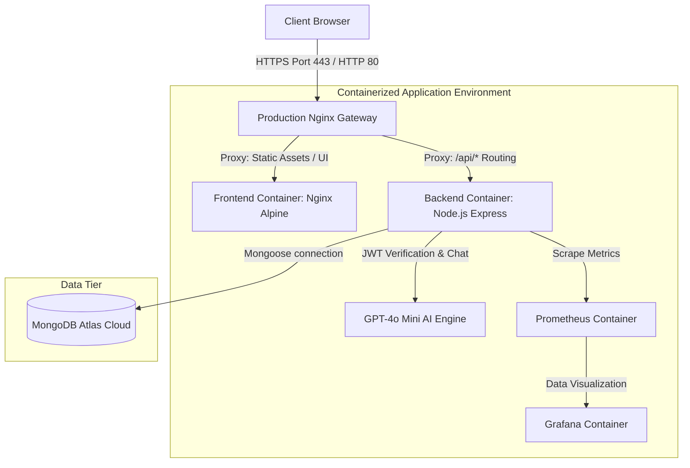
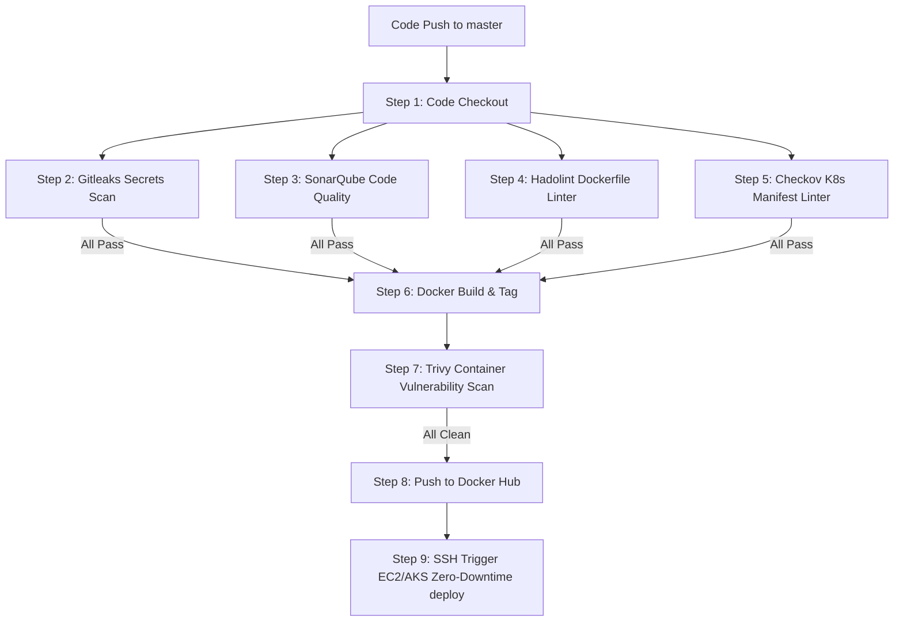
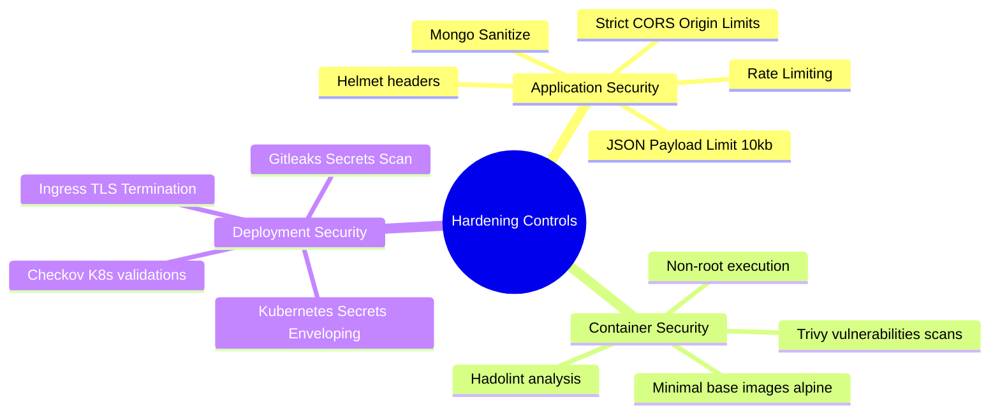

# RAO Travels — Comprehensive System Architecture & Engineering Blueprints

This blueprint details the **System Architecture**, **CI/CD Pipeline**, and **Multi-Tier Security Hardening** implemented across the RAO Travels platform for academic/project evaluation.

---

## 🏛️ 1. Overall System Architecture

The application is engineered as a highly scalable microservice system utilizing a containerized structure proxy-passed through Nginx.



---

## 🔄 2. DevSecOps CI/CD Pipeline

Our automated build-and-test workflow, configured inside `.github/workflows/ci-cd.yml`, integrates strict linting, security scanning, and deployment stages on push to `master`.



---

## 🛡️ 3. Multi-Tier Security Hardening

To ensure enterprise-grade security and prevent malicious exploits, the system applies safety layers at the Application, Container, and Network scopes:



---

## 📸 4. Project Validation Guides

Here is where to capture screenshots for your evaluation deck:

### 🐳 A. Docker & Container Verification
Run the following command locally or on your EC2 instance to demonstrate active containers:
```bash
docker ps
```
*Expected screenshot elements:* Three active containers (`rao-travels-frontend`, `rao-travels-backend`, `rao-travels-proxy`) running on ports 80, 5000, and 443 respectively.

### ☸️ B. Kubernetes Cluster Status
Run these commands inside your local Minikube or AKS cloud cluster:
```bash
kubectl get all -n rao-travels
kubectl get ingress -n rao-travels
```
*Expected screenshot elements:* Displaying two active replica sets (frontend & backend), matching ClusterIP services, and the active Ingress route holding host mapping values.

### 📈 C. Real-Time Telemetry & Monitoring
Load your Prometheus dashboard to confirm active target metrics scrapers:
```bash
http://your-ec2-public-ip:9090/targets
```
*Expected screenshot elements:* Active endpoints for both `rao-backend` and `rao-frontend` showing status `UP`.
